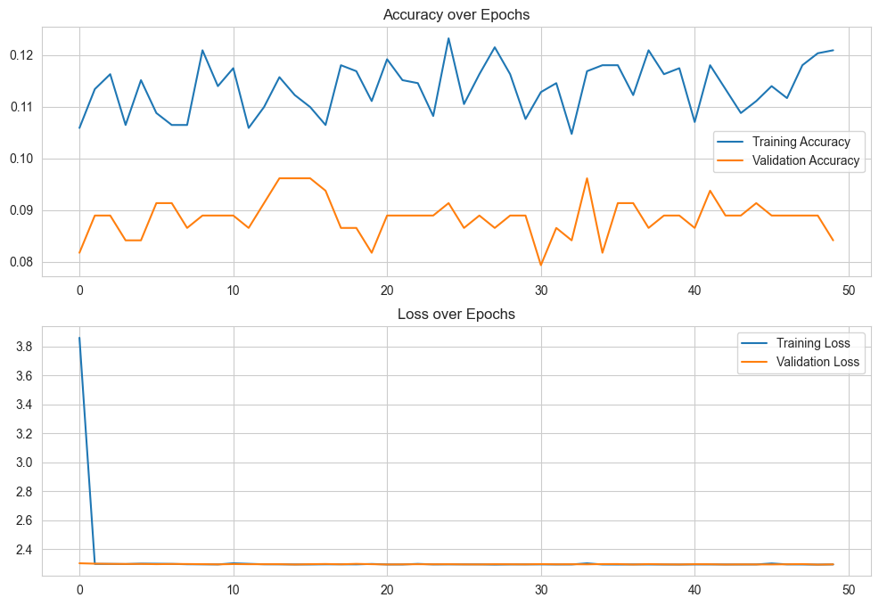
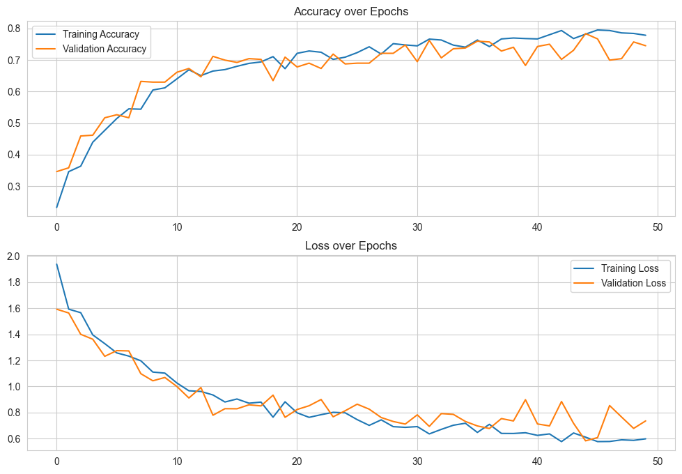
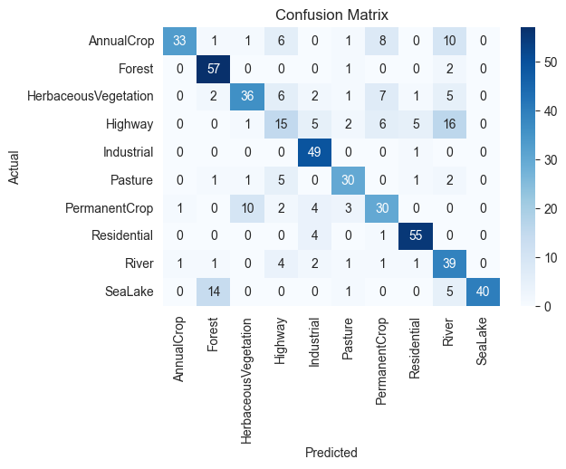
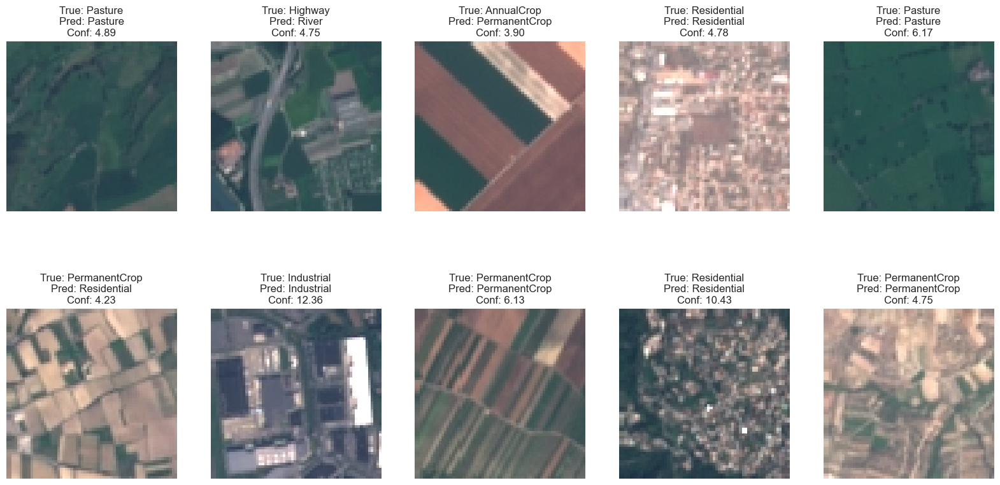
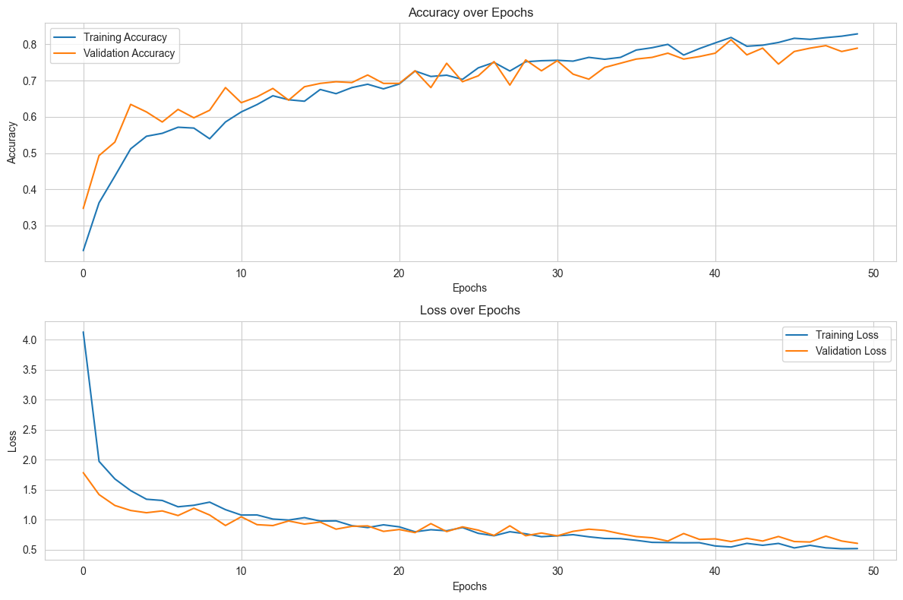
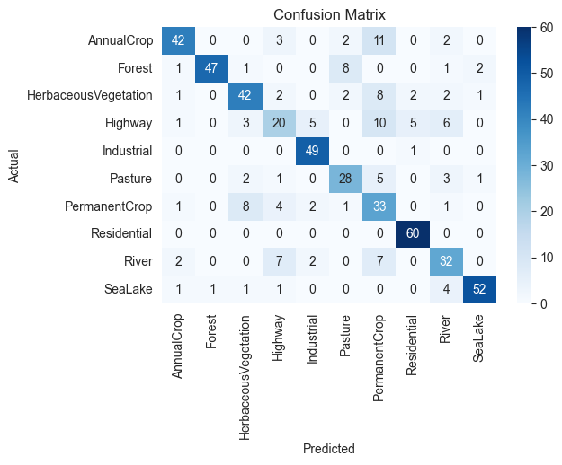
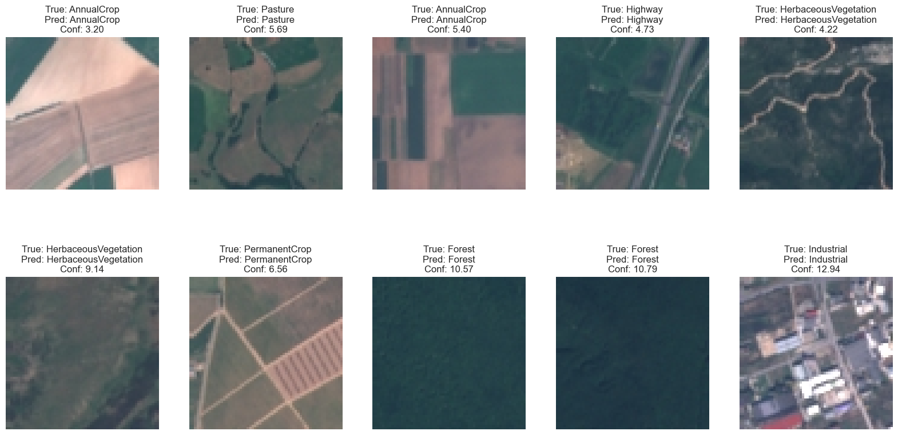

# AI4EO-Project

This project demonstrated image classification using Artificial Neural Networks (ANN), Convolutional Neural Networks (CNN), and Visual Transformers (ViT) to classify land use and land cover in a dataset.It showcases the complete workflow from data loading and model training to result visualization.The dataset comprises satellite images from the Sentinel-2 mission，

## Table of Contents
- [Introduction](#introduction)
- [Installation](#installation)
- [Usage](#usage)
- [Project Structure](#project-structure)
- [Model Description](#model-description)
- [Results](#results)
- [Contributing](#contributing)
- [License](#license)

## Introduction

In this project, we aim to explore the effectiveness of **Artificial Neural Networks (ANN)**, **Convolutional Neural Networks (CNN)**, and **Vision Transformer (ViT)** in categorizing satellite images into different land cover classes. In order to compare these models, I have selected several methods to evaluate the models, including:

**Training and Validation Accuracy**: Counting the accuracy of each epoch during training helps us to see how well the model is learning and to detect any signs of overfitting or underfitting.

**Training and Validation Loss**: These metrics can help us understand the performance of the model from another perspective - how the error decreases over time.

**Confusion Matrix**: It helps identify which categories are well-predicted and which are often confused with others.

**Plotting Sample Predictions**: A number of randomly selected samples of satellite imagery from each category are plotted to show their predictions with their true labels and provide confidence scores to visualize the predictive effectiveness of the model.


Clone the repository or download the notebook


## Usage

1. Ensure your dataset is organized in the following structure:
    ```
    data/
    ├── category1/
    │   ├── image1.jpg
    │   ├── image2.jpg
    │   └── ...
    ├── category2/
    │   ├── image1.jpg
    │   ├── image2.jpg
    │   └── ...
    └── ...
    ```

2. Run the Jupyter Notebook to perform model training and evaluation:


## Project Structure

- `Project.ipynb`: Main notebook file containing complete code for data loading, model building, training, and evaluation.
- `data/`: Dataset folder containing images organized by category.

## Model Description

This project uses three different neural network models for image classification:

1. **Artificial Neural Network (ANN)**:
    - ANN is the most basic neural network model and is only suitable for simple image classification tasks.

2. **Convolutional Neural Network (CNN)**:
    - CNN introduces convolution and pooling operations on the basis of ANN to make effective use of spatial information and local correlation of images, which is suitable for processing image data.

3. **Vision Transformer (ViT)**:
    - A transformer-based model that can effectively handle global information in images.

## Results

The training process will output various charts, including training loss and accuracy, confusion matrix, and sample prediction results. For example:

- **Training Loss and Accuracy:**

  

  

  
- **Confusion Matrix:**

  

  

- **Sample Predictions:**

  

  

## Reference

[1] Eurosat: A novel dataset and deep learning benchmark for land use and land cover classification. Patrick Helber, Benjamin Bischke, Andreas Dengel, Damian Borth. IEEE Journal of Selected Topics in Applied Earth Observations and Remote Sensing, 2019.

[2] Introducing EuroSAT: A Novel Dataset and Deep Learning Benchmark for Land Use and Land Cover Classification. Patrick Helber, Benjamin Bischke, Andreas Dengel. 2018 IEEE International Geoscience and Remote Sensing Symposium, 2018.

[3]EuroSAT: Land Use and Land Cover Classification with Sentinel-2 https://github.com/phelber/eurosat

